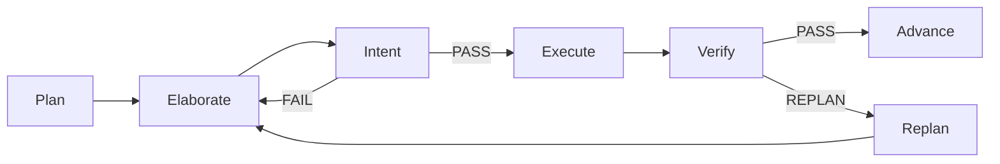

# Execution behaviour

Execute mode (`./determined -exec`) runs against a `PLAN.md` / `STEPS.md` pair
in the current working directory. Combined with `--plan`, it starts after
planning succeeds and the user answers `y` or `yes` to
`Plan approved — begin execution? [y/N]` — any other answer, including bare
Enter, exits with the plan files intact and no execution. Invoking
`determined` with neither flag defaults to execute mode. `STEPS.md` must be a markdown checkbox list — one `- [ ]` item per
step, each carrying a `Purpose:` line stating the step's functional intent
(the outcome it exists to achieve, e.g. "Email messages are throttled to
prevent DDOS", not "Add message payloads to a queue") and ending with a
`Done when:` line stating a checkable acceptance condition (the format
`--plan` produces). A missing `Purpose:` line is tolerated at execution
time — the step still runs — but planning enforces one per step. The orchestrator parses this file
itself every iteration; it never trusts the tool's own claim of completion.

Use `--exec-model <model>` to select a model only for execute-loop
invocations. Planning, plan review, criteria capture, and the interactive plan
session continue to use `--model`; when `--exec-model` is omitted, execution
also uses `--model` or the selected CLI's default. The execution model is
supported by `droid` and `claude`, rejected with `pi`, and must accompany a
command that has an execution phase.

## Live status and agent chat

Headless `-exec` starts the same ephemeral status server used by interactive
sessions, prints its `http://localhost:<port>/` URL, writes the well-known
session record, and streams execution progress into it. When execution ends,
the server shuts down and its record is cleared. A bind failure is reported on
stderr but does not alter the execute loop or its exit code.

The server binds loopback (`127.0.0.1`) by default, so state-changing
endpoints such as `POST /implement` — which starts unattended execution — are
reachable only from the local machine. Exposing the page to the network is an
explicit opt-in via `--status-host` (e.g. `--status-host 0.0.0.0`).

The loopback bind alone does not stop a hostile web page riding the user's own
browser, so under the default bind every request must carry a local `Host`
header (`localhost`/`127.0.0.1`/`[::1]` with the bound port) and the WebSocket
upgrade rejects a non-local `Origin`. Independently of bind host, all
state-changing endpoints (`/implement`, `/annotate`, `/task/skip`,
`/task/stop`, `/stall/choice`, `/explain/start`, `/chat/ask`) require the
per-session token from the served page's `session-token` meta tag in the
`X-Session-Token` header; requests without it get `403`. The status page
itself is served with `X-Frame-Options: DENY` and
`Content-Security-Policy: frame-ancestors 'none'`, so a hostile site cannot
iframe it and clickjack the Implement button.

Status snapshots contain workflow state and log-entry headers, not growing log
bodies. Output is retained in a fixed 2,000-line circular buffer; the event
stream sends a small `logs` notification when data advances, and the browser
pulls sequential batches from `GET /logs?since=<sequence>` only after rendering
the prior batch. A client that falls behind buffer wrap receives a dropped-line
marker and continues from the oldest retained line.

`determined -link` and `determined -chat` share verified discovery: the saved
record is accepted only when its process is alive and its port answers as a
determined status server. `-chat -m "status"` performs one WebSocket round trip;
`-chat` subscribes to live phase, workflow-step, and log events while accepting
questions from stdin.

The WebSocket protocol uses JSON text frames:

```json
{"id":"1","type":"message","text":"status"}
{"id":"1","type":"reply","text":"The session is execution running...","data":{"intent":"status","phase":"execution running"}}
{"type":"event","event":"step","text":"verifying step 3","data":{"intent":"activity"}}
```

`POST /chat/ask` provides the same deterministic reply over plain HTTP. Full
field definitions and curl examples are in [USAGE.md](USAGE.md).

## Startup

- If `PLAN.md` or `STEPS.md` is missing, the run exits **1** immediately with a
  message naming the missing file — nothing is invoked against an unplanned
  directory.
- A stale `STOP.md` sitting alongside unchecked steps is deleted with a
  warning instead of instantly ending the run as success.
- With specialist reviews enabled, an existing `STOP.md` alongside completed
  steps is also removed so a previous run cannot bypass the current review
  sequence.

## Each iteration

1. **Completion check** — if every step is checked *and* the whole-plan
   audit's `STOP.md` exists → exit **0**. A `STOP.md` that appears while
   unchecked steps remain is deleted (with a warning) and the loop continues.
2. **Budget check** — if `--max-duration` / `-t` is exhausted → exit **1**. The
   budget is checked *between* iterations, so an in-flight tool run always
   finishes first.
3. **Prompt construction** — the orchestrator re-reads `STEPS.md` and aims the
   tool at exactly the next unchecked step, injecting the step text, its
   `Purpose:` intent when present, and its
   `Done when:` criterion, plus the `NOTES.md` read/append instructions (see
   below). When every box is checked, the iteration runs the documentation
   update, then the specialist review sequence, then the whole-plan audit. If `STEPS.md` contains no parseable
   checkboxes, the tool is asked to restore a checkbox-format step list or
   confirm completion.
4. **Invocation** — the tool's command runs, streaming its output live **and**
   teeing it to `logs/iter-NNNN-<timestamp>.log`. Each invocation is bounded
   by `--max-iteration-duration` (default **15m**, `0` = unlimited); a timed
   out invocation counts as a failed invocation, not an interruption. A single
   step's cumulative runtime across invocations is bounded by
   `--step-max-runtime` (default **15m**, `0` = unlimited); like the budget it
   is checked between invocations, and a step still unchecked past the cap
   stops the run with exit **1**.
   Each stage starts with a brief timestamped status such as
   `==> [2026-07-11 09:30:00] executing step 2`.
5. **Failure handling** — a non-zero tool exit retries the same iteration
   until `--max-consecutive-failures` (default **3**) failures occur in a row;
   any success resets the count. Only when the cap is hit does the run abort
   with exit **1**. `SIGINT` / `SIGTERM` stop immediately with exit **1**.
6. **Verification pass** (`--verify`, default **on**) — for every step this
   iteration newly checked, one fresh reviewer invocation confirms the
   acceptance criterion actually holds. If it does not, the reviewer unchecks the step in
   `STEPS.md` and appends what is wrong to `FIXES.md`, so the loop re-runs
   it. Planning performs one whole-plan simplicity review before refinement;
   `--step-simplicity` opts into the former additional simplicity invocation
   before each correctness review.
7. **Git checkpoint** (`--git-checkpoint`, default **on**) — each newly
   checked step that survived verification is committed as
   `determined: step N: <step text>` (`git add -A && git commit`). Outside a
   git repository the checkpoint is skipped with a terminal note; a failed git
   command is noted and ignored.
8. **Stall detection** — if `--max-stalled-iterations` consecutive iterations
   (default **3**) finish without a newly checked step:
   - With `--tie-breaker` (default **on**), an independent AI invocation first
     evaluates the deadlock. It reads the goal, the stalled step, the
     implementation, and the verifier's rejections from `FIXES.md`, then
     produces a structured verdict:
     - **ACCEPT**: the step is checked and the run resumes without further
       verification of that step.
     - **REJECT**: the tie-breaker's guidance is queued in `NOTES.md` for the
       worker to follow; once the worker re-implements the step, its
       verification is skipped.
     - If the tie-breaker's output is unparseable or its invocation fails, it
       falls through to the interactive status page's tiebreak modal.
   - Without `--tie-breaker` and without the interactive status page, the run
     stops with exit **3**.
   Checking any step resets the counter; a verifier or audit rejection counts
   as no progress, which bounds worker/reviewer ping-pong. `0` disables stall
   detection.

## Whole-plan audit, selected specialist reviews, and documentation

Checked boxes alone are not success. Once every step is checked, one
invocation first updates the project's own documentation so it describes the
work as it now stands: `README.md`, plus any other documentation the project
already keeps (a `docs/` directory, `AGENTS.md`, `CLAUDE.md`, `BUILD.md`,
usage or configuration references, changelogs). It documents only what this
work changed or added — new or renamed commands, flags, environment variables,
endpoints, configuration, and setup or build steps — and corrects statements
the work made wrong. It is the only completion-stage invocation that edits
files rather than reporting findings, and it does not touch code, tests,
`PLAN.md`, `STEPS.md`, `TESTS.md`, or `CRITERIA.md`. A failed documentation
invocation blocks the later gates until the next iteration.

Then `--specialized-reviews` (default **on**) runs three fresh, independent
review invocations in order:

1. **Security** — authentication/authorization, trust boundaries, injection,
   validation, secrets, cryptography, dependencies, and sensitive data.
2. **Performance** — complexity, unbounded work, I/O, allocations,
   concurrency, resource leaks, and relevant benchmark/profile evidence.
3. **Reliability and maintainability** — errors, races, cleanup, edge cases,
   tests, compatibility, readability, coupling, and project conventions.

A reviewer reports only concrete, actionable findings. It appends the finding
and evidence to `FIXES.md`, then reopens the relevant checkbox or adds an
unchecked remediation step with a `Done when:` criterion. That immediately
blocks later gates; after remediation, all specialist reviews run again.
Risks recorded in PLAN.md under `## Accepted trade-offs` are not reopened;
a specialist that considers one unsafe may add an `Advisory (<specialist>):`
line to `NOTES.md` without changing the steps.
`--specialized-reviews=false` skips these three gates.

Once all steps are checked, one read-only invocation first reads `GOAL.md`,
`PLAN.md`, and `STEPS.md` and audits whether the implementation genuinely
satisfies the plan:

- If a step is not actually satisfied, the audit unchecks it and appends the
  reason to `FIXES.md` — the loop resumes on that step.
- If `CRITERIA.md` exists (written by a `--criteria` session), the audit also
  requires each of its BDD journey tests to exist as an automated test and
  pass; a missing or failing test adds a new unchecked remediation step and a
  `FIXES.md` entry.
- If `TESTS.md` exists, the audit requires each recommended journey/BDD test
  to exist as an automated test and pass; a missing or failing test adds a
  new unchecked remediation step with a `Done when:` requiring that test to
  be implemented and passing, plus a `FIXES.md` entry.
- If everything is satisfied, its `SATISFIED` verdict is remembered and is not rerun.

The orchestrator then runs only the specialists selected by the plan review
profile. Each specialist runs once and reports structured must-fix or advisory
findings without editing files. Advisories go to `NOTES.md`; must-fix findings
become remediation steps. A completed remediation receives one closed
`RESOLVED`/`UNRESOLVED` re-check instead of restarting the audit or specialists.
Every verifier rejection, audit gap, must-fix finding, and unresolved re-check
spends from one shared remediation budget: trivial 1, small 2, medium 4, large
6, overridden by `--remediation-budget`. After all findings close, docs run
once and the orchestrator creates `STOP.md`.

Only *all steps checked + `STOP.md` present* ends the run with exit **0**.

For an execution started from the interactive planning page, a successful
audit is followed by a presentation-only invocation. It inspects the run's git
history and diff, writes `EXPLANATION.md`, and publishes that markdown on the
page's **Explanation** tab. The tab starts with the change's intuition and then
shows the most important design changes with colored unified diffs.

After the explanation succeeds, a second invocation reads it alone, writes five
validated multiple-choice questions to `QUIZ.json`, and publishes them on the
**Quiz** tab. Each question's `sourceSection` must exactly match a `##` heading
in the explanation; invalid output gets one regeneration attempt and is never
published if it remains ungrounded. The artifact has this shape:

```json
{"questions":[{"question":"What changed?","choices":["A","B","C","D"],"correctIndex":0,"rationale":"Why A is correct.","sourceSection":"Exact explanation heading"}]}
```

The page presents one question at a time, scores the answers locally, and links
each question and result back to its explanation section for review. These
phases run after the Execution tab has already reported success and before the
run branch is squashed. An explanation or quiz failure is reported on its tab
but does not change the successful execute outcome; a failed explanation skips
the quiz.

## Protocol files

| File       | Role                                                              |
|------------|-------------------------------------------------------------------|
| `PLAN.md`  | The plan the steps implement; read by the audit. Required at startup. |
| `STEPS.md` | Checkbox step list with `Done when:` criteria; the loop's source of truth. Required at startup. |
| `STOP.md`  | Created by the orchestrator after audit, selected specialists, remediation, and docs complete; deleted if it appears early. |
| `NOTES.md` | Cross-iteration memory (see below); created by the tool on first use. |
| `FIXES.md` | Why a verifier, specialist, or audit opened work; appended by the orchestrator from structured verdicts. |
| `CRITERIA.md` | Optional user-approved BDD journey tests from a `--criteria` session; enforced by the final audit. |
| `TESTS.md` | Recommended journey/BDD tests from planning; enforced by the final audit. |
| `DEMO.html` | Optional self-contained demo for a trivial planned UI change; shown beneath the interactive Plan tab and never used as execution input. |
| `EXPLANATION.md` | Presentation-only walkthrough generated after a successful interactive execution; it does not gate the run outcome. |
| `QUIZ.json` | Five-question quiz generated from a successful explanation; every question includes a `sourceSection` matching an explanation `##` heading and is validated before publication. It does not gate the run outcome. |

## NOTES.md

Each iteration runs in a fresh tool invocation with no memory of earlier ones,
so the injected prompt tells the tool to read `NOTES.md` (if it exists) before
starting, and to append any decisions, conventions, or gotchas later steps need
to know before finishing. The file lives in the working directory alongside
`PLAN.md` and `STEPS.md` and is created by the tool itself on first use.

## Exit codes

| Code | Meaning                                            |
|------|----------------------------------------------------|
| `0`  | All steps checked and the audit created `STOP.md` (execute), or `PLAN.md` + `STEPS.md` written (plan). |
| `1`  | Any other termination: too many consecutive tool failures, budget exhausted, interrupted, missing `PLAN.md`/`STEPS.md` at startup, or a stalled plan round. |
| `2`  | Usage error (e.g. an unsupported `--tool`, `-m` without `-chat`, a run mode combined with `-chat`, a model flag with `pi`, or `--exec-model` without an execution phase). |
| `3`  | Stalled: too many consecutive iterations without a newly checked step. |

For chat commands, exit `0` means a one-shot reply arrived or an interactive
connection closed cleanly; exit `1` means no verified live session, a timeout,
or a transport failure; exit `2` means invalid flag usage.
## Milestone mode

Milestone mode wraps the normal step loop without changing it. `MILESTONES.md` defines the increments and `.determined/milestones.json` records approvals, verification, and the current revision for resume.



| Bound | Flag | Default |
|---|---|---:|
| Intent retries | `-max-intent-retries` | 2 |
| Replans | `-max-plan-revisions` | 3 |
